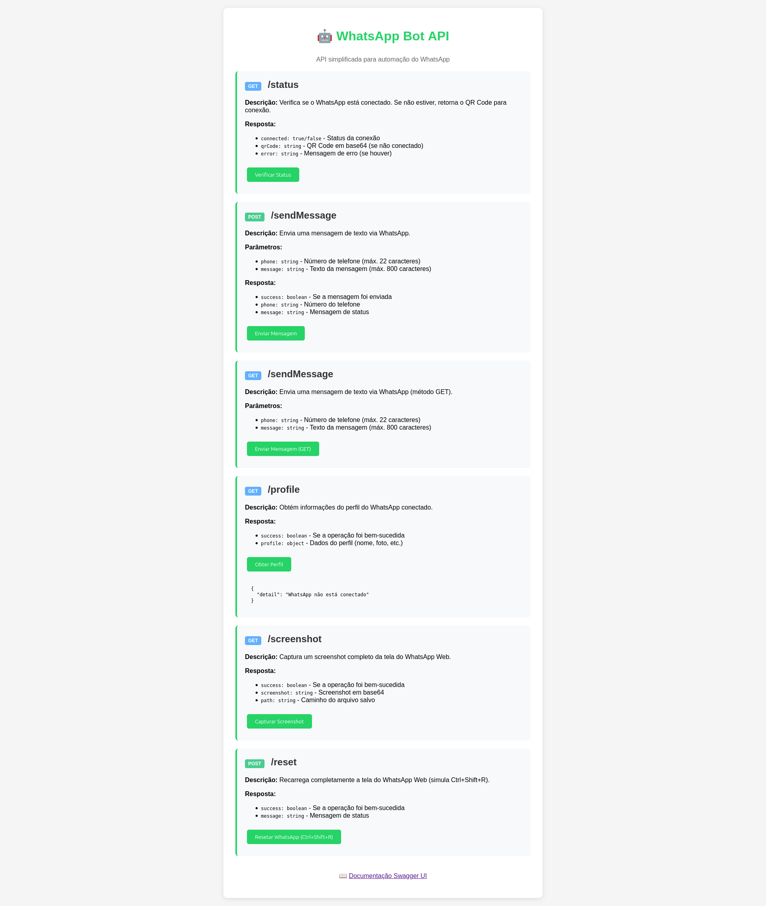
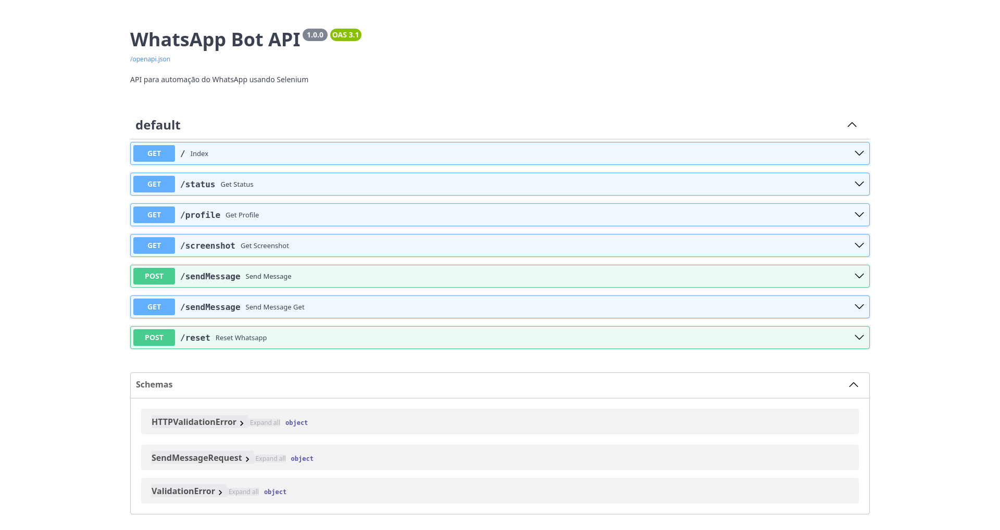

<p align="right">
  <a href="README.md"></a>
  <a href="README.pt-br.md"></a>
  <a href="README.es.md"></a>
</p>

# WhatsApp Bot API - FastAPI

This project was migrated from Flask to FastAPI to improve performance and provide automatic API documentation.

## Main Changes

- **Framework**: Migrated from Flask to FastAPI
- **Main file**: `main.py` (previously `app.py`)
- **Documentation**: Automatic Swagger UI available at `/docs`
- **Validation**: Pydantic models for data validation
- **Performance**: Improved performance with FastAPI

## Available Endpoints

### GET /
- Home page with API documentation

### POST /sendText
- Sends text message via WhatsApp
- Parameters: `phone` (string, max 22 chars), `text` (string, max 800 chars)

### GET /sendText
- Sends text message via WhatsApp (GET method)
- Parameters: `phone` (string, max 22 chars), `text` (string, max 800 chars)

### POST /sendMultText
- Sends message with URL via WhatsApp
- Parameters: `phone` (string, max 22 chars), `text` (string, max 800 chars)

### GET /sendMultText
- Sends message with URL via WhatsApp (GET method)
- Parameters: `phone` (string, max 22 chars), `text` (string, max 800 chars)

## System Screens

### Home Screen



### Swagger Screen

Access the interactive API documentation (Swagger UI) at [`/docs`](http://localhost:8000/docs):



## API Documentation

Access `/docs` to view the interactive API documentation (Swagger UI).

## Execution

### With Docker Compose
```bash
docker compose up --build
```

### Locally
```bash
pip install -r IaC/flask/requirements.txt
uvicorn main:app --host 0.0.0.0 --port 8000
```

## Visual Debug (VNC)

- By default, Selenium runs hidden (`headless`) in `main.py` with:
  - `WINDOW_SHOW_DEBUG = False`
- To show the browser window for debugging, change it to:
  - `WINDOW_SHOW_DEBUG = True`
- Rebuild and restart containers after changing this value:

```bash
docker compose down
docker compose up -d --build
```

### Verify the VNC port

The VNC server is exposed on host port **5914** (see `5914:5914` in `docker-compose.yml`). After the stack is up, confirm the port is listening before opening the viewer:

```bash
ss -tln | grep 5914
```

Or test TCP connectivity:

```bash
nc -zv 127.0.0.1 5914
```

With Docker Compose, you can also show the published mapping for the service port:

```bash
docker compose port fastapi 5914
```

- Open the container desktop via VNC:

```bash
gvncviewer 127.0.0.1:5914
```

- If you use TigerVNC:

```bash
vncviewer 127.0.0.1:5914
```

- When the VNC client asks for a password, use:
  - `V0oiye3R`

## Project Structure

```
├── main.py                 # Main FastAPI application
├── datasource/            # Data modules
├── static/               # Static files
├── templates/            # HTML Templates
├── IaC/flask/           # Docker configurations
│   ├── Dockerfile
│   ├── requirements.txt
│   └── entry_point.sh
└── docker-compose.yml
```

## Environment Variables

Configure the following variables in the `.env` file:

- `MONGOUSER`: MongoDB username
- `MONGOPASSWORD`: MongoDB password
- `MONGODB`: Database name
- `FASTAPIPORT`: Application port (default: 8000)
- `FASTAPINAME`: Container name (default: fastapi-app)

### Initial Setup

1. Copy the example file:
```bash
cp env.example .env
```

2. Edit the `.env` file with your settings:
```bash
nano .env
```

3. Run the project:
```bash
docker compose up --build
```

---

## Contact

Developed by **Victor Luis Santos**  
[LinkedIn](https://br.linkedin.com/in/victor-luis-santos)
