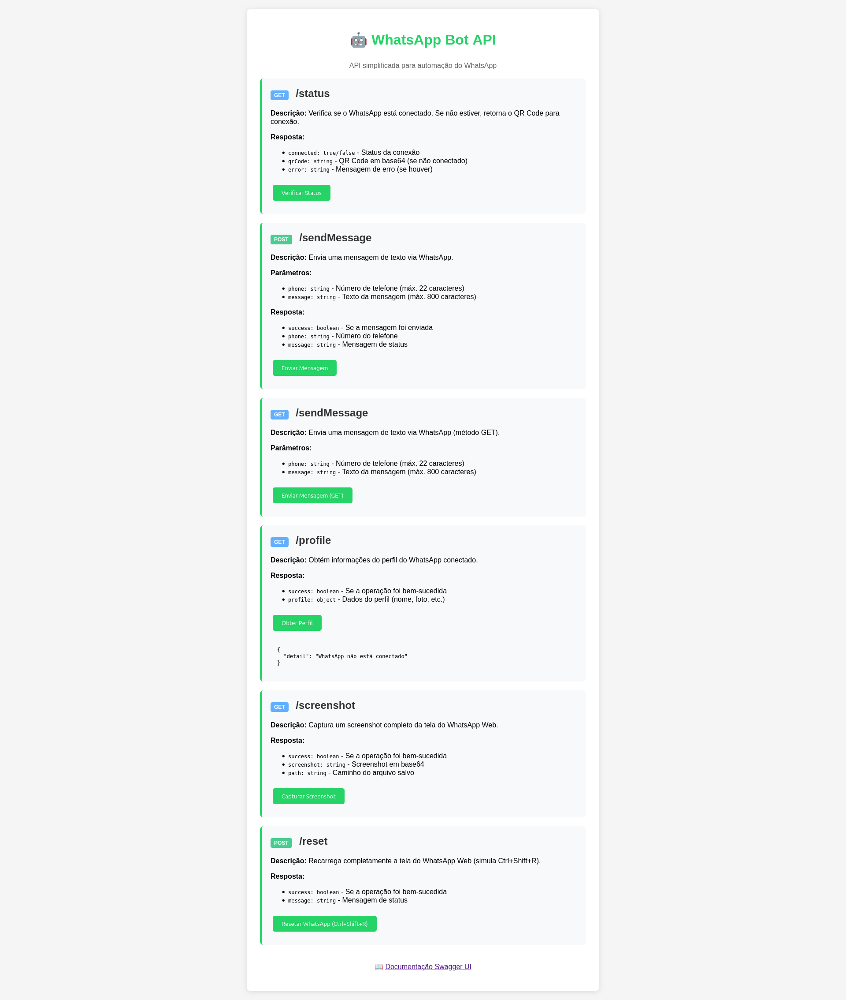
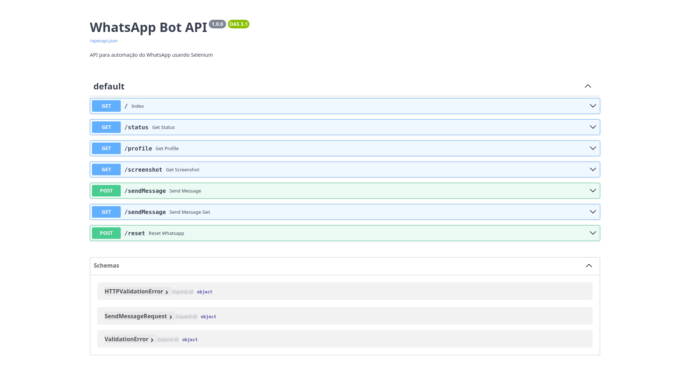

<p align="right">
  <a href="README.md"></a>
  <a href="README.pt-br.md"></a>
  <a href="README.es.md"></a>
</p>

# WhatsApp Bot API - FastAPI

Este projeto foi migrado de Flask para FastAPI para melhorar a performance e fornecer documentação automática da API.

## Principais Mudanças

- **Framework**: Migrado de Flask para FastAPI
- **Arquivo principal**: `main.py` (anteriormente `app.py`)
- **Documentação**: Swagger UI automática disponível em `/docs`
- **Validação**: Modelos Pydantic para validação de dados
- **Performance**: Melhor performance com FastAPI

## Endpoints Disponíveis

### GET /
- Página inicial com documentação da API

### POST /sendText
- Envia mensagem de texto via WhatsApp
- Parâmetros: `phone` (string, max 22 chars), `text` (string, max 800 chars)

### GET /sendText
- Envia mensagem de texto via WhatsApp (método GET)
- Parâmetros: `phone` (string, max 22 chars), `text` (string, max 800 chars)

### POST /sendMultText
- Envia mensagem com URL via WhatsApp
- Parâmetros: `phone` (string, max 22 chars), `text` (string, max 800 chars)

### GET /sendMultText
- Envia mensagem com URL via WhatsApp (método GET)
- Parâmetros: `phone` (string, max 22 chars), `text` (string, max 800 chars)

## Telas do Sistema

### Tela Home



### Tela Swagger

Acesse a documentação interativa da API (Swagger UI) em [`/docs`](http://localhost:8000/docs):



## Documentação da API

Acesse `/docs` para ver a documentação interativa da API (Swagger UI).

## Execução

### Com Docker Compose
```bash
docker compose up --build
```

### Localmente
```bash
pip install -r IaC/flask/requirements.txt
uvicorn main:app --host 0.0.0.0 --port 8000
```

## Estrutura do Projeto

```
├── main.py                 # Aplicação FastAPI principal
├── datasource/            # Módulos de dados
├── static/               # Arquivos estáticos
├── templates/            # Templates HTML
├── IaC/flask/           # Configurações Docker
│   ├── Dockerfile
│   ├── requirements.txt
│   └── entry_point.sh
└── docker-compose.yml
```

## Variáveis de Ambiente

Configure as seguintes variáveis no arquivo `.env`:

- `MONGO_USER`: Usuário do MongoDB
- `MONGO_PASSWORD`: Senha do MongoDB
- `MONGO_DB`: Nome do banco de dados
- `FASTAPI_PORT`: Porta da aplicação (padrão: 8000)
- `FASTAPI_NAME`: Nome do container (padrão: fastapi-app)

### Configuração Inicial

1. Copie o arquivo de exemplo:
```bash
cp env.example .env
```

2. Edite o arquivo `.env` com suas configurações:
```bash
nano .env
```

3. Execute o projeto:
```bash
docker compose up --build
```

---

## Contato

Desenvolvido por **Victor Luis Santos**  
[LinkedIn](https://br.linkedin.com/in/victor-luis-santos)
